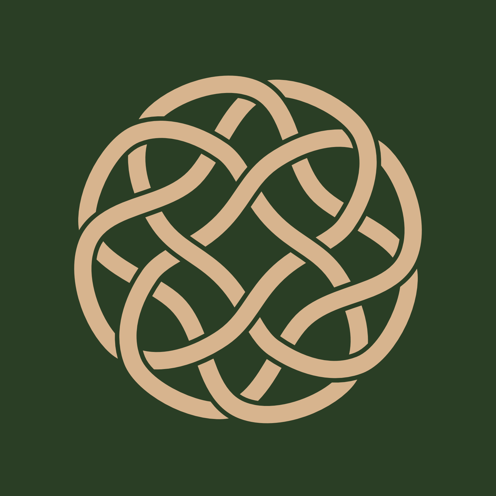
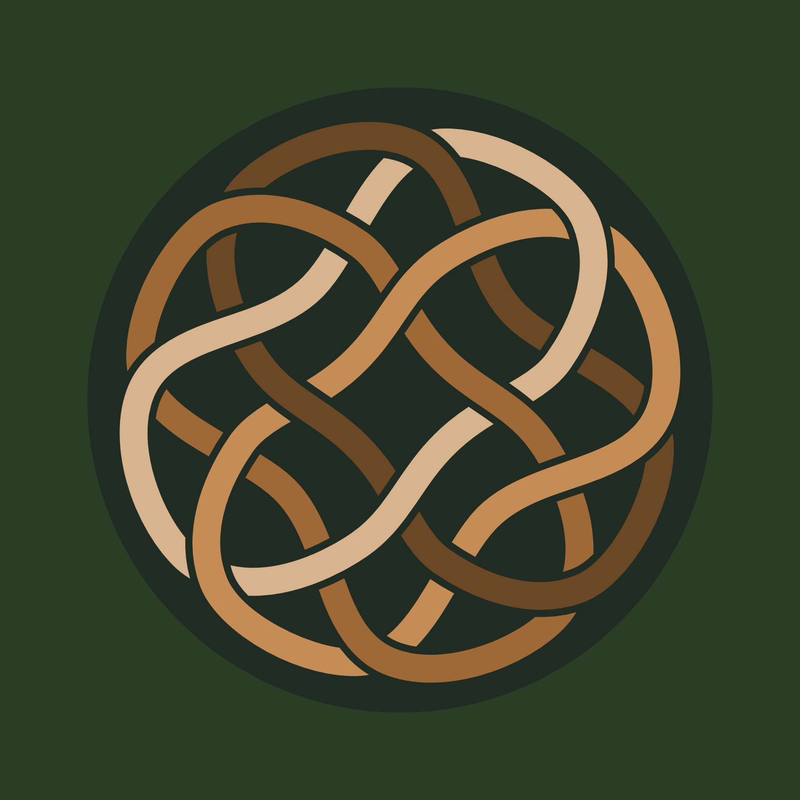
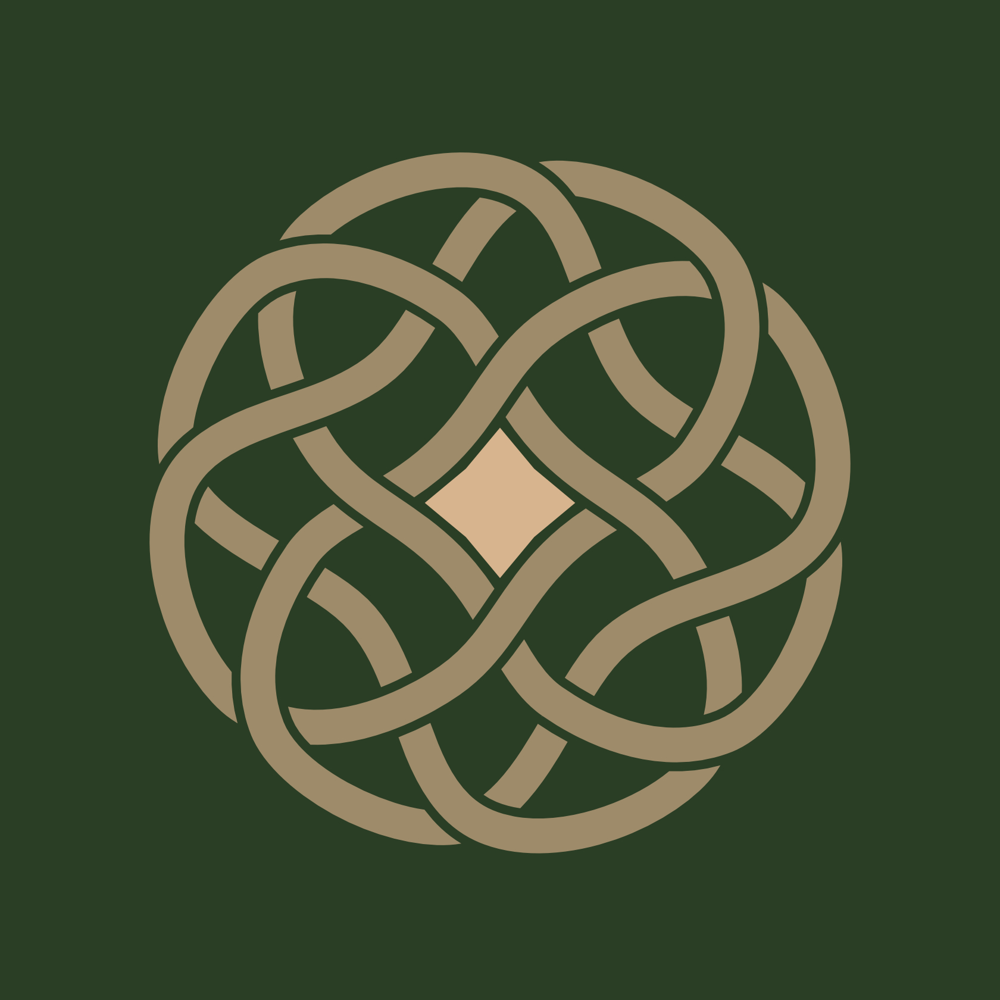
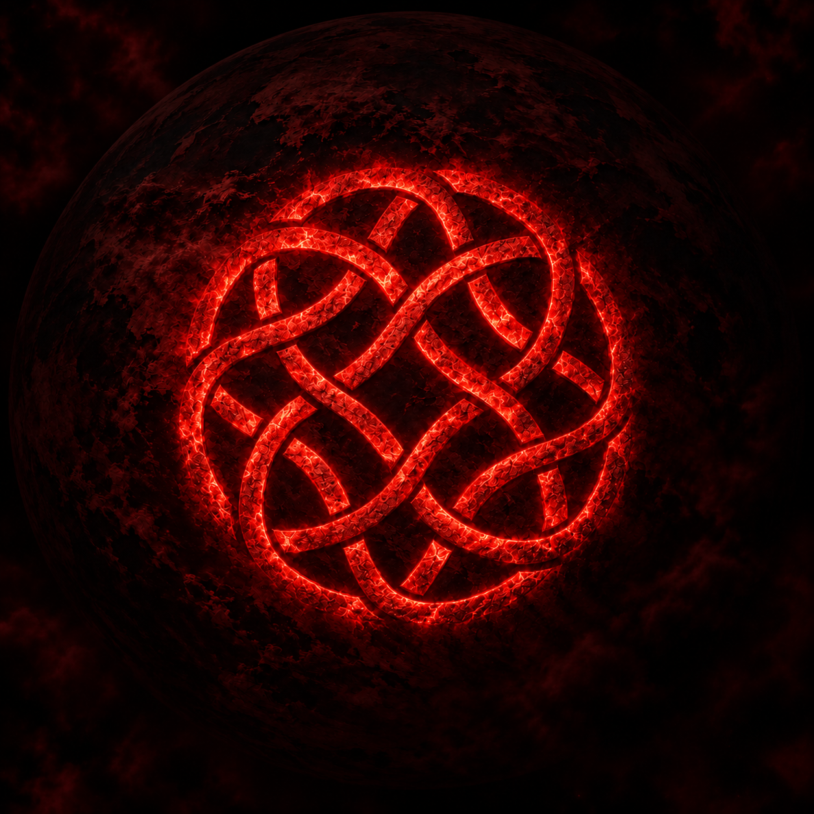

Some symbols have been inherited from the past, while others were created deliberately. Críos is neither. It is a personal symbol that first appeared to me as an image and only later began to reveal its structure and meaning. Over time, it became the central mark of my work and an expression of the philosophy behind it.

Críos does not tell you which path to take. It asks something more difficult of you:

**Whatever path you choose, choose it with pure intention.**

## Four Cells, One Symbol

At first glance, Críos may appear to be a single continuous geometric form, yet its structure is remarkably simple. It is made of **four identical cells**.

Each cell is rotated around a common centre. None is more important than the others, and none contains the complete symbol on its own. Críos only emerges when all four take their place in relation to one another.

The rotation creates movement, but there is no single direction in which that movement must continue. The whole form remains balanced around its centre, where something unexpected happens.

## The Star

At the centre of Críos is a star. It emerges from the negative space created by the four surrounding cells. Remove their relationship to one another and the star disappears. This is important, because the centre is not another object added to the symbol; it exists through the relationship of everything that surrounds it. And from this seemingly empty centre, eight directions emerge.

## Eight Directions

Looking at the central star, it would be easy to interpret its eight points as the directions of a compass, but the meaning is different. We live in three-dimensional space, and therefore have six fundamental directions of movement:

**forward and backward, left and right, up and down.**

Three axes, with two possibilities on each, give us six directions through space. Our existence, however, has another dimension: time. Within it are two more directions: **the past and the future.**

Six directions through space and two through time make the final eight directions, with the observer standing at their centre.

## The Centre Is Now

Between the past and the future there is a strange place. It is **Now.**

It is the only moment in which we can truly choose and act. We can remember the past. We can learn from it, return to it in our memories and allow it to influence us. We can imagine the future. We can hope for it, fear it, prepare for it and try to shape it. Neither of them, however, is the place where a decision is made.

Every decision happens now. Yet the present cannot be grasped. The moment we try to hold onto it, it has already become the past. The centre of Críos is therefore not a fixed place where we can remain. It is an elusive point from which the possibility of movement continually arises.

## Freedom of Movement

Críos contains no arrow. There is no marked path leading from its centre, and no direction is labelled as the correct one. You can move forward or return. Rise or descend. Turn left or right. Carry something with you from the past or move towards something that does not yet exist.

**All directions remain open.** This matters because freedom loses much of its meaning when someone else has already chosen the path for us. To stand at the centre means having the possibility to move. Yet freedom of movement itself is not the essence of Críos. Movement is preceded by **Intention.**

## Purity of Intention

We often judge our decisions by their consequences. The problem is that consequences belong to the future, and the future is one of the directions we cannot yet experience.

A decision made with the best understanding available to us at that moment may take us somewhere we did not expect. Another may fail completely. Later, we may discover things that we simply could not have known when the decision was made.

Críos does not ask for certainty, but for honesty at the moment when a decision is born.

**What is my intention?**

This is where freedom acquires responsibility. If the intention is pure, the movement that follows is complete in itself, because the decision was made honestly in the only place where it could ever be made — the present.

Críos is a commitment to the purity of intention with which I choose my path, not a promise that I will always choose the right one.

## Before I Understood It

Around the winter solstice of 2025, a form appeared to me during meditation against a deep red background.

In my memory, the image has an almost planetary quality: darkness, a vast red world or presence in the background, and before it the form that would later become Críos.

I drew what I remembered and then decided to reconstruct it more precisely. As I worked with it, its inner geometry gradually revealed itself: four identical rotating cells, the space between them, and the star that emerged at their centre. This is how Críos entered my life.

## Why Críos?

*Críos* is an Irish word meaning **a belt or band** — something you wrap or fasten around yourself. The idea behind the symbol is a voluntary commitment made at our centre: a commitment to pure intention.

You remain free to choose your direction through space and time. What you commit yourself to is the honesty with which you make that choice.

## The Mark of Críos

Today, Críos has become the seal of my work. You may find it carved into wood, printed on paper, or accompanying objects that leave my workshop.

I do not see it merely as a logo or a symmetrical mark. It represents something I want to carry into the things I create: the act of creation itself should begin with pure intention.

An object will eventually leave my hands and continue its existence somewhere I cannot foresee, with someone I may not yet know. I cannot determine its path, but I can determine how that path begins. This is the simplest way I can describe Críos.

*May you always find your centre,*  
*may every direction remain open to you,*  
*and whatever path you choose,*  
*may you walk it with pure intention.*
