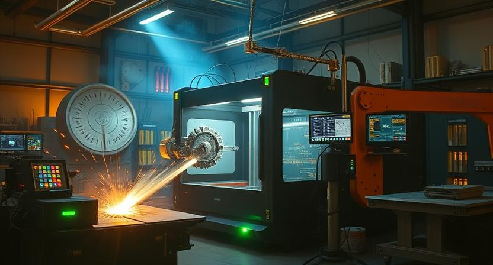

**In the world of CNC machining, efficient Computer-Aided Manufacturing (CAM) software is essential. FabEX, evolving from the open-source BlenderCAM project, offers a unique solution for both professionals and hobbyists seeking high performance, advanced features, and seamless integration with 3D modeling.**

FabEX combines robust toolpath generation with Blender's powerful visual environment, providing a comprehensive and adaptable tool for tackling modern manufacturing challenges.

## Key Advantages of FabEX in CNC Machining

FabEX delivers several critical benefits that enhance workflow and productivity, making it an appealing alternative to traditional commercial CAM solutions:

### 1. Deep Integration with Blender
- **Seamless Workflow:** As an add-on within Blender, FabEX eliminates the need for constant geometry import/export. Modeling, editing, and toolpath creation happen within a unified environment.
- **Superior Visualization:** Leveraging Blender’s advanced rendering and visualization capabilities, users can perform accurate machining simulations, collision detection, and preview surface finishes before the actual machining process begins.

### 2. Support for Multi-Axis Machining
- Designed for modern manufacturing, FabEX supports 3-axis, 4-axis (rotary), and in some versions, 5-axis machining. This versatility is crucial for producing complex geometries and intricate parts.

### 3. Wide Range of Strategies and Fine Control
- The system offers a comprehensive suite of toolpaths, from 2D milling and engraving to advanced roughing and finishing strategies. This ensures optimal material removal, surface quality, and efficiency.
- Users retain detailed control over milling parameters, allowing customization for various materials—such as wood, metals, or plastics—and different tooling setups.

### 4. Open-Source Foundation and Community
- Building on BlenderCAM’s open-source ethos, FabEX benefits from a vibrant community and continuous development. This transparency allows for customization, troubleshooting, and ongoing improvements, often at little to no cost.

## What the Latest FabEX Release Offers

FabEX development focuses on enhancing efficiency, reliability, and user experience. While updates continually evolve, current priorities include:

- **Optimized Computation:** Improving algorithms to significantly reduce processing times for complex 3D and multi-axis toolpaths.
- **Advanced Machining Strategies:** Incorporating adaptive and trochoidal milling techniques for faster, safer operations, and extended tool life.
- **Expanded Post-Processing Support:** Adding and refining post-processor compatibility to ensure smooth integration with a wide range of CNC controllers and G-code dialects.
- **User-Friendly Interface:** Streamlining Blender’s interface to facilitate quicker setup, even for newcomers, and improve overall usability.

## Conclusion

FabEX stands out as a sophisticated yet accessible CAM solution, especially suitable for those already familiar with Blender or seeking a flexible, multi-axis capable system without the expense of commercial licenses. With its open-source foundation and active development, FabEX is well-positioned to transform digital designs into precise physical components, making it an excellent choice for modern CNC machining.
