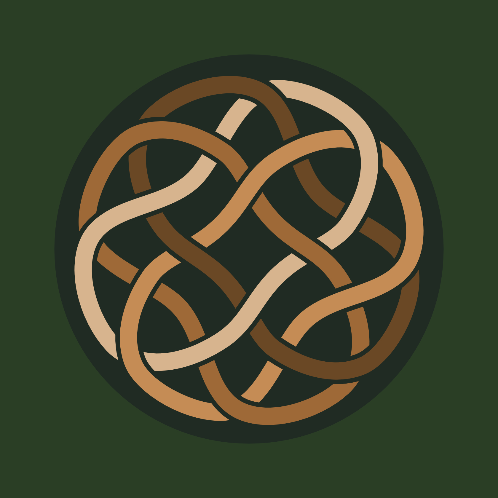
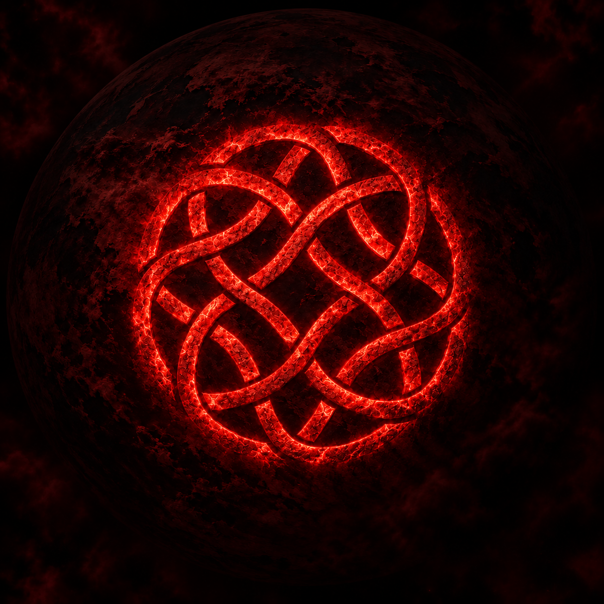

# IMHEIN — The Seal of the Druid’s Journey

IMHEIN is a symbol I made for the philosophy I call *Imthecht in Druad*, the Druid’s Journey. It is a contemporary symbol, but it does not look like one.

It came to me as an image, and it looked like a prehistoric artefact. Its lines were not perfect, yet it commanded respect. I was drawn to its archaic look, to the fact that it is built from equal parts, and to the feeling it gave me of commitment: something that binds and holds together. Only later did I begin to see in its structure a language of movement, presence, freedom and responsibility.

IMHEIN does not tell you which path to take. It asks one thing of you:

**Whatever path you choose, choose it with pure intention.**

<!-- PHOTO 1: main seal, sand-coloured on deep green (formerly crios-v2.jpg) -->

## Four Cells, One Symbol

IMHEIN is made of four identical cells. Each one is the same shape, turned a quarter of a turn around a common centre. None is more important than the others, and none contains the whole symbol on its own. The seal only exists when all four are together.

Because the cells are turned, the seal seems to move. But it has no arrow, and nothing in it points to a destination.

The cells are also woven into each other, and this is what holds the seal together. It was the hardest part to draw. As a whole, the form was easy to put on paper. The difficulty was in the joins, in every place where two paths cross and one has to pass over the other. I kept redrawing those crossings. A shape that is simple from a distance turned out to be demanding up close.

<!-- PHOTO 2: four cells in distinct colours (formerly crios-cells-v1.jpg) -->
<!-- OPTIONAL PHOTO 2b: one cell on its own next to its four rotations, so readers can see they are identical -->

## The Star Within

At the centre of IMHEIN there is a star with four softly curved points. I did not draw it as a separate shape. It appears in the space the four cells leave between them, and if you take the cells away, it is gone.

The centre is empty, yet it is the part of the seal you see first.

<!-- PHOTO 3: central negative space highlighted (formerly crios-star-v1.jpg) -->

## Eight Directions

I do not count eight points on the drawing. The eight directions are a reading I give to the way the centre opens, and it is a symbolic one.

We move through space in six directions: forward and backward, left and right, up and down. We also live in time, which gives two more, the past and the future. Six through space and two through time make eight. At the place where they meet stands the human being, not looking at the seal from outside, but at its centre.

## The Centre Is Now

The place from which we can choose is the one between past and future: now.

We can remember the past and learn from it. We can imagine the future, hope for it, fear it, prepare for it. But no decision can be made in either of them. Every act begins in the present. And the present cannot be held; as soon as we try to grasp it, it has already become the past. That is why the centre of IMHEIN is empty. It is not a place to stay in. It is where each movement begins.

## All Paths Remain Open

No path in IMHEIN is marked as the right one. From the centre you can go forward or go back, rise or descend, turn left or right, carry something from the past with you, or step towards a future that does not exist yet.

Freedom would mean little if the seal chose for us. To stand at its centre is to accept that any movement is possible, and that the responsibility for it comes before the first step.

## Purity of Intention

We usually judge decisions by their consequences. But consequences belong to the future, and we cannot see the future yet.

A choice made with the best understanding I have may still lead somewhere unexpected. It may fail. Later I may learn something I could not have known at the time. So IMHEIN does not ask for certainty or perfection. It asks for honesty at the moment a choice is made:

**What is my intention?**

A pure intention does not guarantee an easy road or a good outcome. It means that I begin without deliberate deceit, towards others or towards myself. It also means that I cannot choose a path I know will harm others and still call my intention pure, because knowingly causing harm already contains a deceit.

IMHEIN is my personal commitment to the purity of intention with which I choose my path. It is not a promise that I will always choose rightly.

## Before I Understood It

Around the winter solstice of 2025, a form appeared to me during meditation against a deep red background.

In my memory, the image has an almost planetary quality: darkness, a vast red world or presence behind it, and in front of it the form that would later become IMHEIN.

The form was very dark, like the smouldering glow of embers in a hearth. It looked like an ancient artefact, but also like a hologram projected into space. The lines were not perfect, and it still commanded respect.

I drew what I remembered, then redrew the interweaving of the knots again and again, until it settled into the symmetry I had seen in the meditation. As I worked, its inner geometry gradually revealed itself: four identical rotating cells, the open space between them, and the star emerging at their centre. The image came first; my understanding followed.

<!-- PHOTO 4: planetary red reconstruction (formerly crios-planetary-v4.png); consider a higher-resolution export, current one is 1254 px -->

## The Name Imhein

**Pronunciation:** **IM-hine** — /ˈɪm.haɪn/. Say *im* as in *him* without the initial *h*, followed by *hine*, rhyming with *mine*. The stress falls on the first syllable, and the *h* between the two syllables is clearly pronounced. It is not pronounced *eye-m-hine*.

The name is a modern coinage. It is **not a historical Celtic or Old Irish word**, and I do not present it as an ancient name recovered from tradition. Like the seal, it was made in the present.

I read it as **I-mhein**: the English *I*, the self who stands at the centre and takes responsibility for the choice (*my intention, my commitment, my path*). The opening *Im-* also ties the name to *Imthecht in Druad*, the philosophy the seal belongs to.

In spelling, the name echoes the Irish *méin*, a word associated with mind, disposition or nature. The resemblance is one of spelling, not of sound, and I am not claiming it as an etymology. IMHEIN does not borrow antiquity to justify itself. Its meaning comes from the symbol, the philosophy and the commitment it names.

## The Seal of the Druid’s Journey

*Imthecht in Druad* is built from Old Irish words and means “the journey of the druid”. It is my own name for this philosophy, and IMHEIN is its seal.

I use it every day. It is my logo, either on its own or placed in front of the name Paul Creos. It is printed on the shipping boxes that carry my work to other people, it is on a large stamp, and it is in my watermarks. I also print it and cut it on a plotter as a personal symbol, and it is on my druid’s drum, a frame drum. So it is more than a logo or a maker’s mark. It is something I live with.

<!-- PHOTO 5: the seal on the druid's frame drum (to be added); adjust the alt text to match the photo. If you remove the photo for now, delete this line. -->

A box leaves my workshop and goes along a path I cannot foresee, to someone I may not yet know. I cannot decide where it goes, but I can decide how it begins: with attention, honesty and a clear intention in the present moment.

That is what IMHEIN stands for. I cannot promise that every road will be right, only that none should be chosen carelessly.

*May you always find your centre,*  
*may every path remain open to you,*  
*and whatever path you choose,*  
*may you walk it with pure intention.*