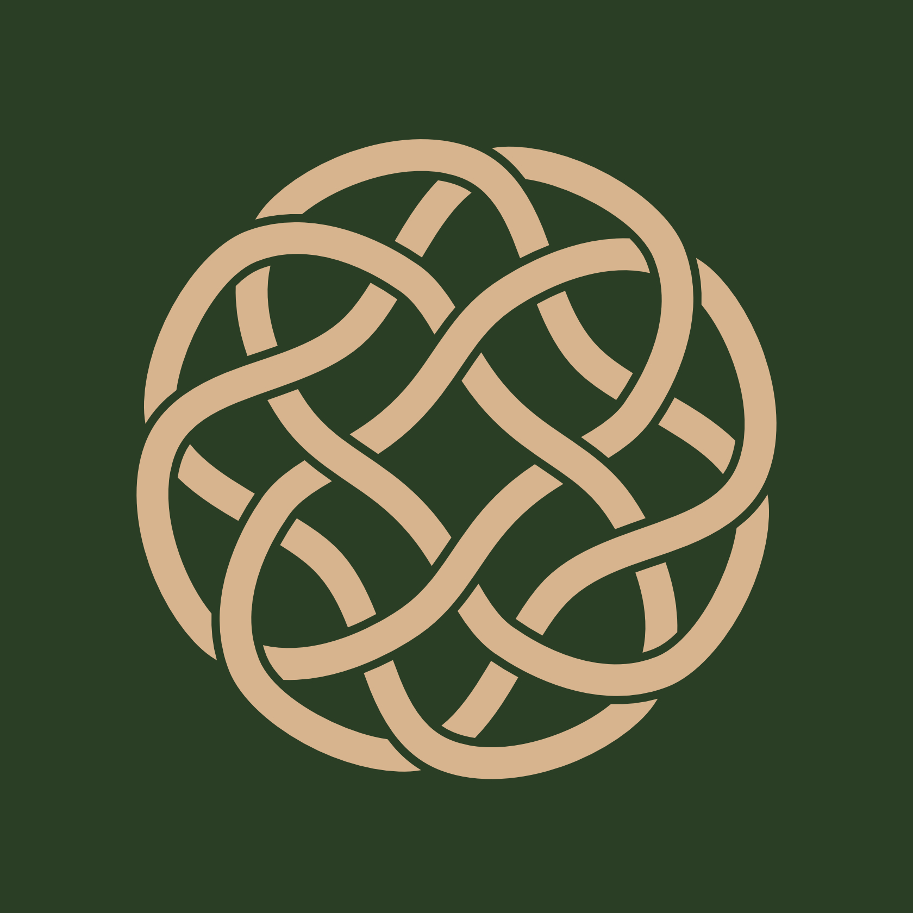
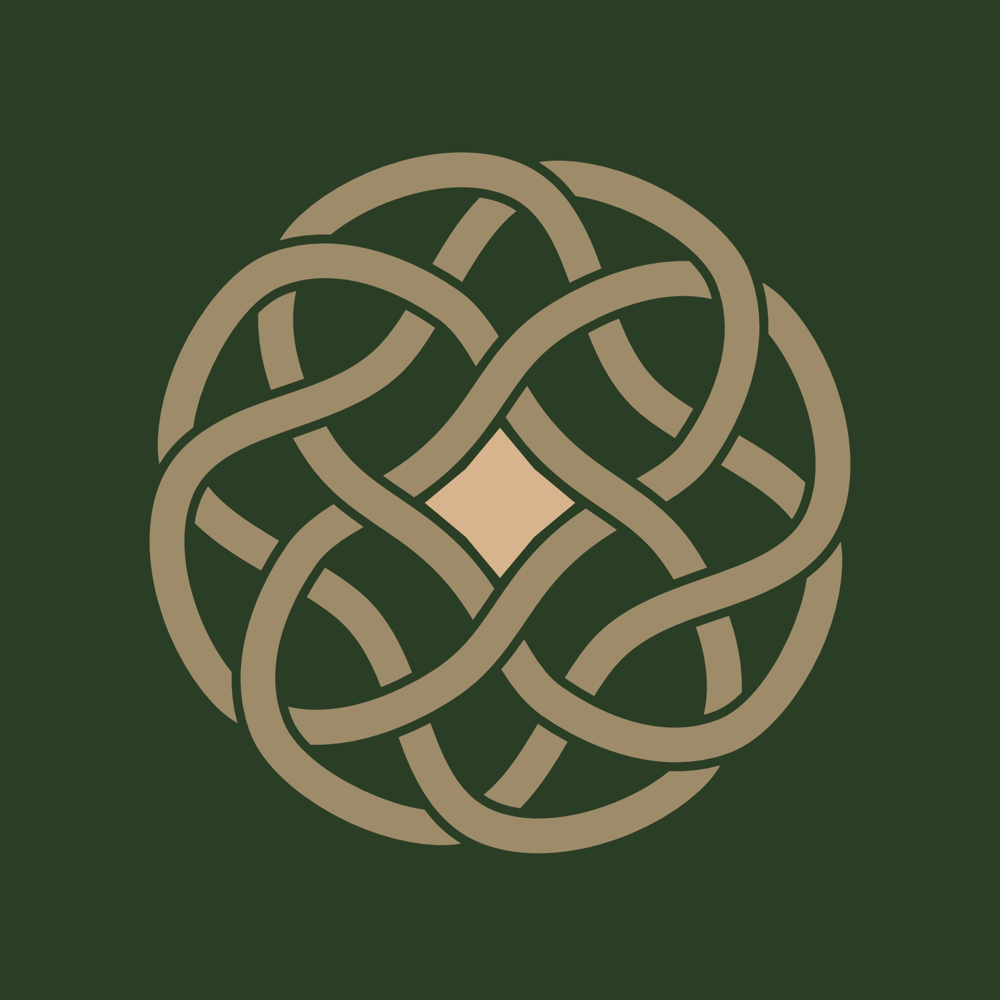

Some symbols come to us from the past. Others are born in the present and gather meaning as we learn to see what they contain. **IMHEIN** is an original contemporary symbol: the seal of the philosophy of *Imthecht in Druad*, the Druid's Journey.

It first appeared to me as an image. Only later did its structure begin to reveal a language of its own — one of movement, presence, freedom, and responsibility. What emerged was not a map showing the correct road, but a personal seal of commitment to the intention with which any road is chosen.

IMHEIN does not tell you which path to take. It asks something more difficult of you:

**Whatever path you choose, choose it with pure intention.**

## Four Cells, One Symbol

At first glance, IMHEIN may appear to be a single continuous geometric form, yet its structure is remarkably simple. It is made of **four identical cells**.

Each cell is a rotation of the same form around a common centre. None is more important than the others, and none contains the complete symbol on its own. IMHEIN emerges only when all four enter into relationship.

Their rotation gives the seal a sense of movement, but does not prescribe a direction. The form remains balanced around its centre, where something unexpected appears.

## The Star Within

At the centre of IMHEIN is an eight-pointed star. It is not drawn as a separate shape or placed on top of the design. It arises from the negative space held between the four surrounding cells. Take away their relationship and the star disappears.

This matters. The centre is not an object to possess, but a presence made visible by what surrounds it. It is there, unmistakably, yet there is nothing solid to grasp. From that open centre, eight directions emerge.

## Eight Directions

The eight points may suggest the directions of a compass, but their meaning reaches beyond a flat surface. We live in three-dimensional space, with six fundamental directions of movement:

**forward and backward, left and right, up and down.**

Three axes, each opening in two ways, give us six directions through space. Human existence also unfolds through time, which adds two more: **the past and the future.**

Six directions through space and two through time make eight. At their meeting point stands the human being — not outside the seal, looking in, but at its centre.

## The Centre Is Now

Between past and future is the only place from which we can choose: **Now.**

We can remember the past, learn from it, and carry it with us. We can imagine the future, hope for it, fear it, prepare for it, and try to shape it. Neither, however, is where a decision can be made. Every act begins in the present.

And yet the present cannot be held. The moment we try to grasp it, it has already become the past. The star at the centre of IMHEIN embodies this elusive presence: real but unpossessable, empty yet full of possibility. It is not a fixed place in which we can remain, but the point from which movement continually begins.

## All Paths Remain Open

IMHEIN contains no arrow. No path is marked as the correct one. From the centre, you may move forward or return, rise or descend, turn left or right, carry something from the past, or step towards a future that does not yet exist.

**All paths remain open.** Freedom would mean little if the seal chose on our behalf. To stand at its centre is to accept both the possibility of movement and the responsibility that comes before it. IMHEIN does not sanctify a particular destination. It returns our attention to the intention from which the first step is taken.

## Purity of Intention

We often judge decisions by their consequences. But consequences belong to the future, and the future is a direction we cannot yet experience.

A choice made with the best understanding available to us may lead somewhere unexpected. It may fail. Later, we may learn what we could not have known at the moment of decision. IMHEIN therefore asks for neither certainty nor perfection. It asks for honesty at the instant in which a choice is born:

**What is my intention?**

This is where freedom acquires responsibility. A pure intention does not guarantee a painless road or a flawless outcome. It means that the movement begins without deliberate deceit — towards others or towards oneself.

IMHEIN is a personal commitment to the purity of intention with which I choose my path, not a promise that I will always choose the right one.

## Before I Understood It

Around the winter solstice of 2025, a form appeared to me during meditation against a deep red background.

In my memory, the image has an almost planetary quality: darkness, a vast red world or presence behind it, and in front of it the form that would later become IMHEIN.

I drew what I remembered, then began to reconstruct it more precisely. As I worked, its inner geometry gradually revealed itself: four identical rotating cells, the open space between them, and the star emerging at their centre. The image came first; my understanding followed.

## The Name Imhein

**Pronunciation:** **IM-hine** — /ˈɪm.haɪn/. Say *im* exactly as in *him* without the initial *h*, followed by *hine*, rhyming with *mine*. The stress falls on the first syllable, and the *h* between the two syllables is clearly pronounced. It is not pronounced *eye-m-hine*.

The name is a modern coinage. It is **not a historical Celtic or Old Irish word**, and it is not presented as an ancient name recovered from tradition. Like the seal itself, it was created in the present.

Its inner reading begins with **I-mhein**: the English *I*, the self who stands at the centre and accepts responsibility for the choice — *my intention, my commitment, my path*. The form **Im-mhein** also creates a deliberate bond with *Imthecht in Druad*, the philosophy to which the seal belongs.

The name resonates in sound and appearance with the Irish *méin* and its lenited form *mhéin*, words associated with mind, disposition, or nature. This is a meaningful resonance, not a claim of historical etymology. IMHEIN does not borrow antiquity to justify itself; its meaning comes from the symbol, the philosophy, and the commitment it names.

## The Seal of the Druid's Journey

Today, IMHEIN is the seal of *Imthecht in Druad* — **The Seal of the Druid's Journey**. It may be carved into wood, printed on paper, or accompany objects that leave my workshop. But it is more than a logo or a maker's mark.

It is a personal seal of commitment to pure intention. An object will eventually leave my hands and continue along a path I cannot foresee, with someone I may not yet know. I cannot determine that path, but I can determine how it begins: with attention, honesty, and a clear intention in the present moment.

That is the promise carried by IMHEIN. Not that every road will be right, but that no road should be chosen carelessly.

*May you always find your centre,*  
*may every path remain open to you,*  
*and whatever path you choose,*  
*may you walk it with pure intention.*
