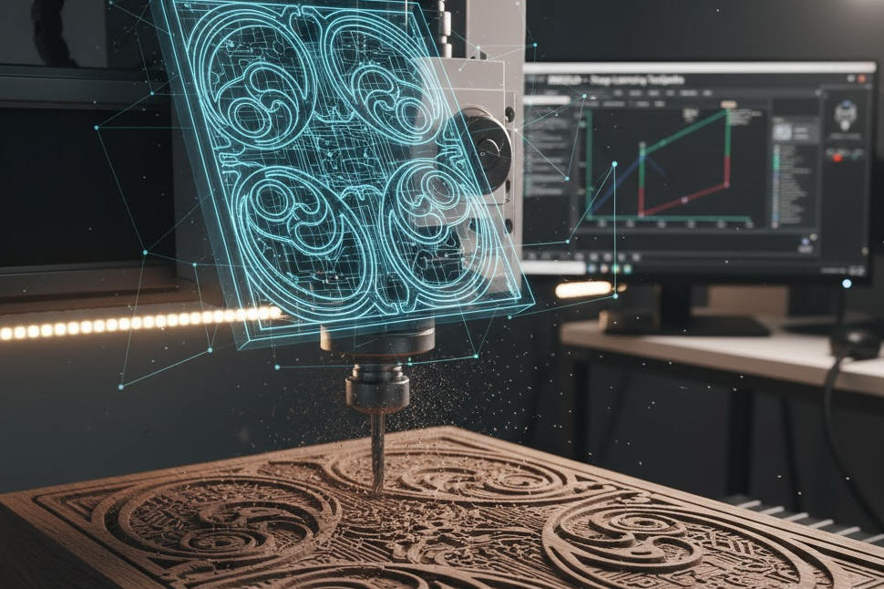

The world of CNC milling is rapidly evolving, transforming digital designs into stunning physical creations. For creators aiming to elevate their 3D relief projects, **Marigold** emerges as a game-changer. This innovative tool leverages **Deep Learning** to generate optimized toolpaths, delivering unmatched precision, efficiency, and surface quality for complex reliefs.

Unlike traditional CAM software, **Marigold** (available on GitHub under prs-eth) uses advanced neural networks to intelligently analyze 3D models and create toolpaths that minimize machining time while maximizing detail. Whether you're crafting intricate ornaments, topographic art, or custom engravings, Marigold redefines what's possible in CNC relief milling.

## Why Marigold Stands Out

Relief milling is notoriously complex, demanding precise toolpaths to achieve fine details and smooth transitions. Marigold excels by combining Deep Learning—a technology that mimics human learning to optimize decisions—with CNC expertise. Here's why it’s a must-have for relief projects:

1. **Intelligent Toolpath Optimization**: Marigold analyzes the relief's geometry, adapting toolpaths to follow natural curves and contours. This results in smoother surfaces, reducing the need for post-milling finishing.
2. **Time-Saving Efficiency**: By predicting optimal feed rates and minimizing unnecessary tool movements, Marigold significantly reduces machining time.
3. **Superior Detail Precision**: Perfect for intricate designs like portraits or textures, Marigold ensures high accuracy, especially with small-diameter conical or ball-nose end mills.
4. **Material Versatility**: While adaptable to various materials, Marigold shines in woodworking, accounting for grain and structure to optimize cutting strategies.

## From 3D Model to Flawless Relief

Marigold simplifies the journey from a 3D model (e.g., STL or OBJ) to a finished relief. Its Deep Learning algorithms process the model and generate G-code tailored for precision and efficiency. The result? Sharp edges, smooth transitions, and minimal tool marks—giving creators a competitive edge in producing high-quality, marketable pieces.

## Marigold Workflow: From Model to CNC Machine

Marigold’s Deep Learning-powered toolpath generation streamlines the CNC relief milling process. Below is a step-by-step guide to using this open-source tool, available on GitHub.

### Phase 1: Environment and Model Setup

Prepare your system and 3D model for Marigold’s processing.

| Step | Action | Description |
|------|--------|-------------|
| **1. Set Up Environment** | `git clone https://github.com/prs-eth/Marigold` `pip install -r requirements.txt` | Clone the Marigold repository and install dependencies (e.g., PyTorch or TensorFlow) for Deep Learning. |
| **2. Prepare 3D Model** | Use `input_model.stl` or `.obj` | Ensure your relief model (e.g., an artistic panel) is in STL or OBJ format, accurately representing the desired shape. |
| **3. Configure Parameters** | Edit `config.yaml` | Define milling parameters in the config file, including: - **End Mill**: Conical or ball-nose - **Tool Diameter**: e.g., 1.6 mm - **Stepover**: Optimized by Marigold - **Material**: e.g., Hardwood-Oak |

### Phase 2: Toolpath Generation

Marigold’s neural network processes the 3D model to create optimized G-code.

| Step | Action | Description |
|------|--------|-------------|
| **4. Run Script** | `python marigold_generate.py --model_path input_model.stl --output_gcode output_relief.gcode --config config.yaml` | Execute the script to load Marigold’s pre-trained neural network. |
| **5. Model Analysis** | (Internal Process) | The network evaluates the model’s geometry, identifying high-curvature areas and fine details to generate efficient, quality-focused toolpaths. |
| **6. G-Code Output** | Save `output_relief.gcode` | Produces G-code with optimized G0, G1, G2, G3 commands, ready for CNC execution. |

### Phase 3: CNC Execution

Transfer and run the G-code on your CNC machine.

| Step | Action | Description |
|------|--------|-------------|
| **7. Prepare Machine** | Secure material, zero axes | Mount the workpiece (e.g., hardwood) and install the finishing tool. |
| **8. Load G-Code** | Use CNC software | Load `output_relief.gcode` into your control software (e.g., UGS, Mach3). |
| **9. Run Milling** | Monitor process | Observe Marigold’s adaptive toolpaths, which conform to the relief’s contours, delivering a superior finish and reduced machining time. |

## Conclusion

Marigold transforms CNC relief milling by replacing traditional CAM calculations with intelligent, Deep Learning-driven toolpaths. Its ability to optimize for precision, efficiency, and material-specific needs makes it an invaluable tool for creators and professionals. Explore Marigold on GitHub and elevate your CNC projects to new heights.
