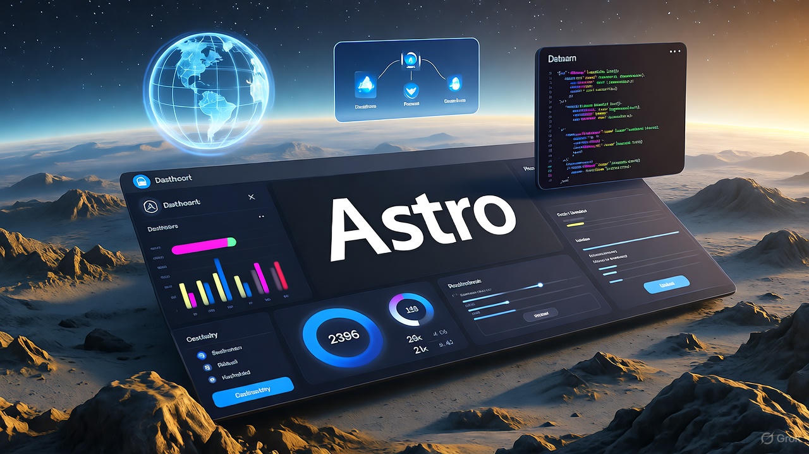

Astro is a go-to framework for building fast, modern websites, but to unlock dynamic, scalable projects, you need a Headless CMS. This guide helps you choose and integrate the best Headless CMS for your Astro project, whether you’re a developer, marketer, or managing a corporate site.

## Why Pair Headless CMS with Astro?

A Headless CMS separates content (back-end) from presentation (front-end), delivering data via APIs (REST or GraphQL). Astro uses this data to create lightning-fast static pages or dynamic components. Key benefits:

- **Speed**: Astro generates static HTML with minimal JavaScript for blazing-fast load times.
- **Flexibility**: Use React, Vue, Svelte, or plain HTML/CSS—Headless CMS delivers data regardless of your framework.
- **Scalability**: CMS offers structured content, team workflows, and asset management beyond what local Markdown files can provide.

## Comparing Top Headless CMS for Astro

Here’s a quick comparison of the top CMS options for Astro projects in 2025:


| CMS         | Pricing            | API              | Live Preview           | Open Source | Astro Integration | Best For            |
|-------------|--------------------|------------------|------------------------|-------------|-------------------|---------------------|
| Sanity      | Free/Premium       | REST, GROQ       | Yes                    | No          | Official          | Developers          |
| Storyblok   | Free/Premium       | REST             | Yes (Visual Editor)    | No          | Official          | Marketers/Teams     |
| Strapi      | Free (self-hosted) | REST, GraphQL    | No                     | Yes         | Community         | Custom Projects     |
| Contentful  | Free/Premium       | REST, GraphQL    | Yes                    | No          | No                | Enterprise          |
| Directus    | Free (self-hosted) | REST, GraphQL    | No                     | Yes         | No                | SQL Enthusiasts     |


## Top Headless CMS Options for Astro

### 1. Sanity: The Developer’s Choice

**Why Choose Sanity?**

- **GROQ Queries**: A powerful query language for precise data fetching, perfect for Astro’s minimal-JS philosophy.
- **Real-time Previews**: Stream content updates for seamless development.
- **Official Integration**: The `astro-sanity` package simplifies setup.
- **Downsides**: Free tier limits scale for larger projects; GROQ has a learning curve.

**Use Case**: Ideal for personal blogs or data-heavy projects needing flexible queries.

**How to Get Started**:

Install:

```bash
npx astro add sanity
```

Fetch and render data:

```astro
---
import { useSanityClient } from 'astro-sanity';

// Fetch blog posts
const posts = await useSanityClient().fetch(`*[_type == "post"]{title, slug}`);
---
<main>
  {posts.map((post) => (
    <a href={`/posts/${post.slug.current}`}>
      <h2>{post.title}</h2>
    </a>
  ))}
</main>
```

**Summary**: Sanity shines for developers with its GROQ power and Astro integration.

### 2. Storyblok: The Editor’s Powerhouse

**Why Choose Storyblok?**

- **Visual Editor**: Lets editors manage content directly within the site’s context.
- **Component-Based**: “Bloks” align perfectly with Astro’s component architecture.
- **Official Partnership**: Optimized SDK and detailed integration guides.
- **Downsides**: Higher cost for advanced features; less flexible than open-source options.

**Use Case**: Perfect for corporate sites where marketers need an intuitive editing experience.

**How to Get Started**:

Install:

```bash
npm install storyblok-js-client
```

Fetch and render:

```astro
---
import { storyblokApi } from '../lib/storyblok';
const { slug } = Astro.params;

const { data } = await storyblokApi.get(`cdn/stories/${slug}`, {
  version: import.meta.env.DEV ? 'draft' : 'published',
});
const story = data.story;
---
<main>
  {story.content.body.map((blok) => (
    <Component blok={blok} />
  ))}
</main>
```

**Summary**: Storyblok excels for teams thanks to its Visual Editor and Astro synergy.

### 3. Strapi: The Open-Source King

**Why Choose Strapi?**

- **Open-Source**: Full control over hosting and data.
- **Custom APIs**: Auto-generates REST and GraphQL endpoints based on your content.
- **Community**: Extensive plugins and support, including `@astrojs/strapi`.
- **Downsides**: Self-hosting can be complex for small teams.

**Use Case**: Great for e-commerce or custom projects needing tailored logic.

**How to Get Started**:

Set up Strapi, define content types, and fetch data:

```astro
---
const STRAPI_URL = import.meta.env.STRAPI_URL;
const response = await fetch(`${STRAPI_URL}/api/articles?populate=*`);
const { data: articles } = await response.json();
---
<section>
  {articles.map((article) => (
    <a href={`/articles/${article.attributes.slug}`}>
      <h3>{article.attributes.title}</h3>
    </a>
  ))}
</section>
```

**Summary**: Strapi is perfect for open-source projects with high customization.

### 4. Contentful: The Enterprise Solution

**Why Choose Contentful?**

- **Reliability**: Global CDN and robust APIs for consistent performance.
- **Scalability**: Built for large, global projects.
- **Downsides**: Higher cost; less Astro-specific support compared to Sanity or Storyblok.

**Use Case**: Suited for multinational companies with extensive content needs.

**How to Get Started**:

Fetch data via REST or GraphQL APIs, similar to Strapi, with a focus on global delivery.

**Summary**: Contentful is reliable for enterprises but less tailored for Astro.

### 5. Directus: The SQL Enthusiast’s Choice

**Why Choose Directus?**

- **SQL Integration**: Turns any SQL database into a Headless CMS.
- **Open-Source**: Modern Vue.js admin panel, fully customizable.
- **Downsides**: Limited Astro-specific support; requires technical expertise.

**Use Case**: Ideal for projects with existing SQL databases.

**How to Get Started**:

Similar to Strapi, with a focus on SQL databases and REST/GraphQL APIs.

**Summary**: Directus is great for developers leveraging existing SQL infrastructure.

## How It Works: Data Flow

Here’s how a Headless CMS integrates with Astro:

| Source           | Target           | Description       |
|------------------|------------------|-------------------|
| Headless CMS     | API (REST/GraphQL) | Delivers Content |
| API (REST/GraphQL) | Astro Build      | Fetches Data     |
| Astro Build      | Static HTML      | Renders          |
| Static HTML      | User Browser     | Displays         |

## Practical Tips for Integration

- **Optimize API Calls**: Use precise queries (e.g., GROQ, GraphQL) to minimize data transfer and speed up builds.
- **SEO-Friendly Output**: Leverage CMS metadata (title, description) and Astro’s `<Head>` for search engine optimization.
- **Caching**: Implement CDN caching for API calls to boost production performance.
- **Live Previews**: Use CMS with live preview (Sanity, Storyblok) for faster development cycles.
- **Community Resources**: Check the [Astro Discord](https://discord.com/invite/astro) or CMS documentation for additional support.

## Real-World Use Cases

- **Personal Blog**: Sanity’s GROQ and free tier make it ideal for developers building fast, content-driven blogs.
- **Corporate Website**: Storyblok’s Visual Editor empowers marketing teams to manage content for landing pages or blogs.
- **E-commerce Platform**: Strapi’s open-source flexibility supports custom product logic and APIs for online stores.
- **Global Enterprise**: Contentful’s global CDN ensures reliable content delivery for multinational websites.
- **Legacy Database Project**: Directus integrates seamlessly with existing SQL databases for custom applications.

## Which CMS Should You Choose?

- **Sanity**: Best for developers and personal projects due to GROQ and Astro integration.
- **Storyblok**: Ideal for teams and marketers with its intuitive Visual Editor.
- **Strapi**: Perfect for open-source projects with custom hosting and logic.
- **Contentful**: Suited for large enterprises with global content needs.
- **Directus**: Great for projects leveraging existing SQL databases.

No matter your choice, Astro’s zero-JS philosophy ensures fast, modern websites. The process is simple: model content in your CMS, fetch data via API, and render it with Astro components. For more, explore [Astro’s documentation](https://docs.astro.build) or your chosen CMS’s guides.
