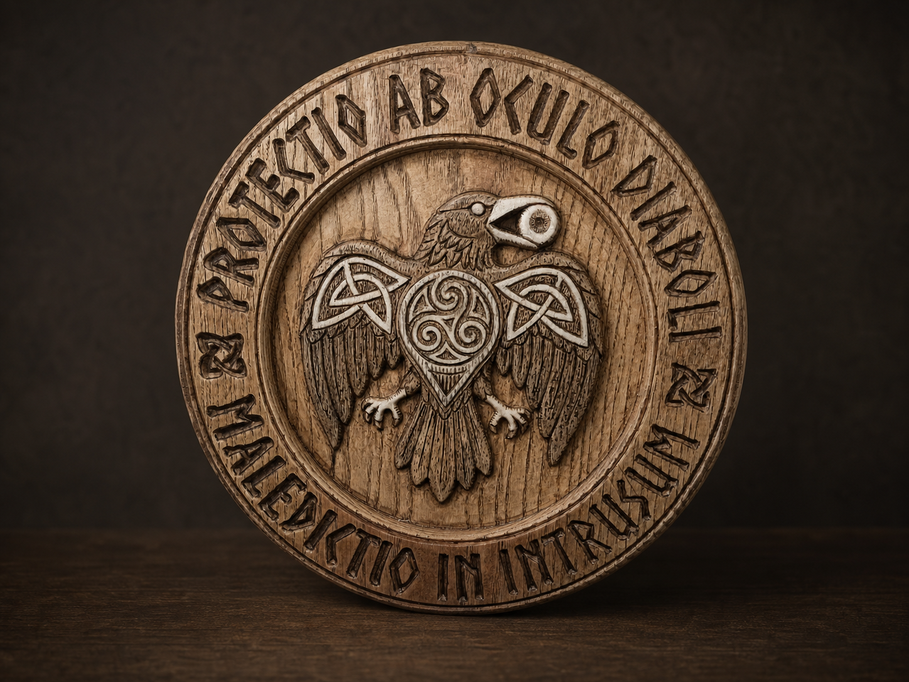
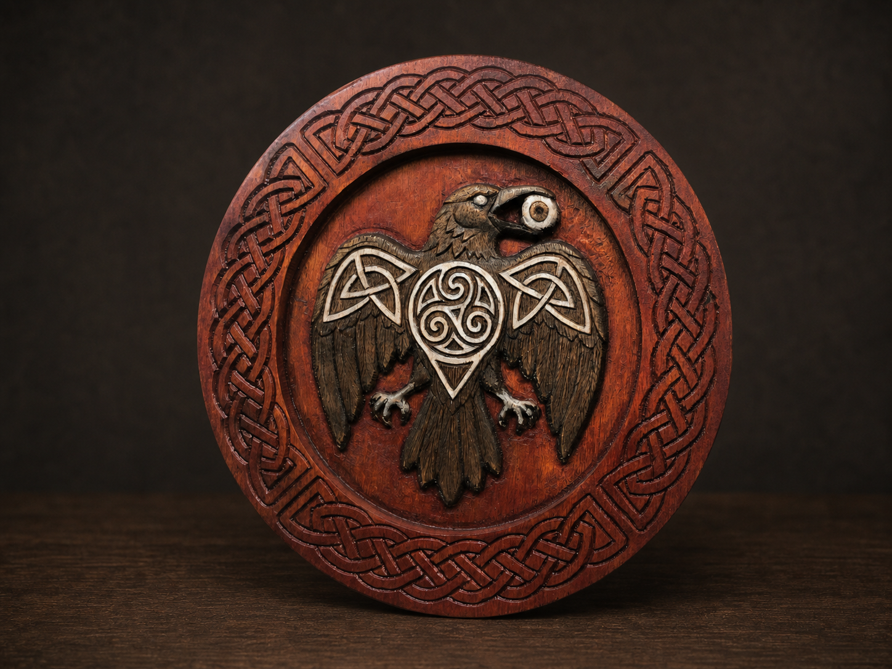

The Raven Sigil is a small circular relief built around vigilance, boundaries, and protection. At its centre, a raven carries a triskele upon its breast. Interlaced forms shape the shoulders, while the raised body and wings emerge from the recessed wooden field.

This is a personal symbolic composition rather than a reproduction of a historical artefact. Its forms draw on Celtic-inspired knotwork, the movement of the triskele, and the raven as an alert presence at the threshold.

## The protective inscription

The inscribed version is guarded by two Latin phrases chosen to act as a spiritual shield:

> **PROTECTIO AB OCULO DIABOLI**  
> Protection from the Evil Eye.

> **MALEDICTIO IN INTRUSUM**  
> A curse upon the intruder.

The phrases form an outer boundary around the raven. They are not simply a caption: their circular placement makes them part of the structure of the work, enclosing the central sigil and reinforcing its protective intent.

## Two variants

I have explored the relief in two forms. One carries the Latin phrases around its perimeter. The second replaces the inscription with continuous Celtic-inspired knotwork, allowing the same central raven to take on a quieter and more ornamental character.

Although they share the same centre, the borders change how each piece is read. The inscription speaks directly of protection and warning; the uninterrupted knot suggests continuity, connection, and a boundary without beginning or end.

## Material and scale

The relief has been produced in ash and birch. Most pieces are approximately **22 cm in diameter** and **22 mm thick**. The compact format keeps the object intimate while leaving enough depth for the raven, the recessed field, and the surrounding border to remain clearly tactile.

## From machine to hand

The process begins with CNC machining, which establishes the circular foundation and removes the main volumes. This is only the starting point. The surface is then refined by hand with small Mikisyo chisels, bringing definition to the feathers, claws, knots, eye, and transitions between raised and recessed areas.

Pyrography with a Razertip tool deepens selected lines and shadows. It gives the interlace greater clarity and helps separate details without concealing the grain of the wood. An Osmo finish completes the piece, protecting the surface while preserving its tactile character.

The result carries traces of both precision and touch: the measured structure of the machine, the irregular decisions of the chisel, the dark line of fire, and the natural variation of the timber.

## Current state

The Raven Sigil is currently part of an evolving body of work and is not yet available through Etsy. Final product photography and availability details will be added when the series is ready for release.
