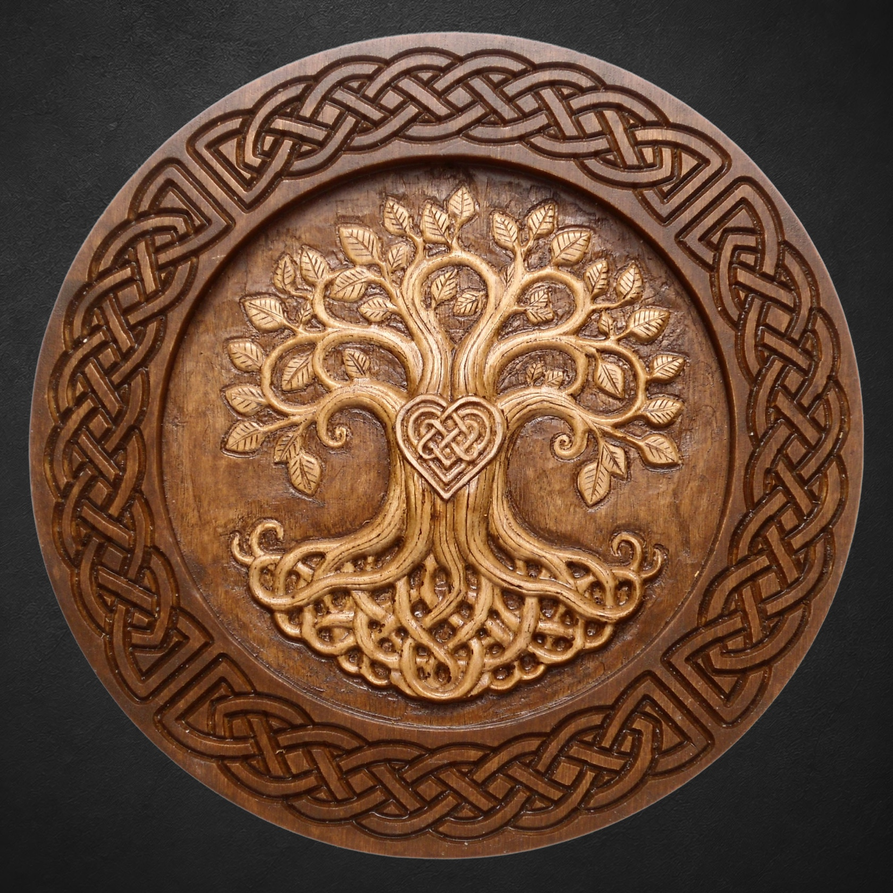

A tree grows in one place, yet its life reaches into different realms.

Its roots disappear into the earth, its trunk stands in the human world, and its crown opens to the sky, wind, rain and sunlight. Year after year, it passes through changing seasons, storms, drought and winter, carrying the marks of everything it has endured.

People move through the landscape, build homes, cross borders and reshape the land around them. A tree may remain in the same place for generations.

Trees held a remarkable position in the Celtic world. They appear beside sacred places, in stories of kingship and territory, near wells and gathering places, and in traditions concerned with knowledge, death and the Otherworld. Their meaning grew from their presence within the landscape and from the communities that gathered around them.

## The Sacred Grove

We know less about the Druids themselves than the abundance of modern literature might suggest. Their teachings were largely transmitted orally, and much of the earliest written evidence comes from Greek and Roman authors observing Celtic societies from outside.

Forests and sacred groves appear repeatedly in these accounts.

In the first century AD, Pliny the Elder described Gaulish Druids and their relationship with oak and mistletoe. According to his account, they chose oak groves as sacred places and performed no rites without oak foliage. Mistletoe growing upon an oak was considered especially significant. During the ceremony Pliny describes, it was cut with a golden sickle and caught in a white cloth. Two white bulls were sacrificed, and the plant was valued as a medicine and protection against poison.

Pliny's account is important, but it is not a complete description of Druidic belief. He was a Roman writer describing a people beyond the Roman world, and his account may contain elements shaped by his own purposes and sources. It does show, however, that the oak and the grove were associated with ritual authority in Gaul.

Other Roman writers also describe sacred woods. Lucan writes of a grove at Massilia where no ordinary person was allowed to enter without fear. Tacitus describes the destruction of a sacred grove on the island of Mona, or Anglesey, during the Roman campaign against the Druids around AD 60. Such accounts are hostile and should be read with care, yet they preserve the image of the grove as a place set apart from everyday life.

The Celtic word *nemeton*, usually translated as a sacred place or grove, survives in place names across Europe. These names do not tell us exactly what happened at every site. They do suggest that sacred spaces connected with groves were once widespread.

## The Trees of Kingship

Irish sources preserve another expression of the tree's importance in the institution known as the *bile*. A *bile* was a revered tree associated with a people, a territory, or a centre of kingship. It could stand near a place of inauguration or assembly, where a king's authority was recognised.

The tree and the community were linked. An attack on a tribe's *bile* was more than damage to a plant. It was an insult to the people whose identity and authority the tree represented. Medieval Irish texts record the cutting down of such trees during raids and conflicts, suggesting that the act had a political and symbolic force.

This relationship helps explain why the tree appears so often beside stories of land and sovereignty. A ruler did not possess the land as an isolated individual. Kingship was tied to a people, a place, its boundaries, and the order that held them together. The tree could stand for that continuity.

## Roots, Trunk, and Crown

The familiar image of a world tree is useful when it grows from the physical nature of a tree itself. The roots enter darkness and soil. The trunk occupies the space where human beings live and travel. The branches rise into weather and light.

We should be careful with the idea that ancient Celtic people followed one uniform doctrine of three cosmic levels. No surviving Druid handbook gives us such a system. The image is an interpretation of relationships that appear in stories, landscapes, and later tradition.

Even so, the tree makes these relationships visible. It joins what is above with what is below while remaining rooted in a particular place. It does not leave the earth in order to reach the sky. Its height depends upon its roots.

This is one reason the tree has remained such a durable symbol. It can speak about ancestry and growth, but also about limits. A human life stretches towards knowledge and possibility while remaining dependent on a body, a family, a landscape, and time.

## Trees and the Otherworld

Irish and Welsh stories often place unusual events beside trees, wells, islands, hills, and boundaries. The Otherworld is not always separated from the human world by a permanent wall. It can approach through particular places, seasons, dreams, or moments of change.

In the *Mabinogi*, the world of the human characters is repeatedly disturbed by powers that do not obey ordinary rules. In Irish literature, trees may mark a meeting place, conceal an entrance, or remain as witnesses to an event. These stories do not create a single Celtic theology of trees. They show that the landscape was capable of holding memory and presence.

A tree is especially suited to this role. It is ordinary enough to stand beside a road or a settlement, yet old enough to have outlived the people who first noticed it. Its age gives it a relationship with the past that no human witness can possess.

## The Oak, the Yew, and the Apple Tree

The oak is the tree most strongly associated with the Druids in the surviving Roman account. Its size, longevity, and resistance to weather made it a natural sign of endurance and strength. The association with mistletoe gave it an additional ritual importance in Pliny's description.

The yew belongs to another part of the symbolic landscape. It can live for centuries, grows near churches and burial grounds, and remains green through winter. These associations made it a fitting tree for memory and death in later British and Irish landscapes. It would be misleading to turn this into a fixed ancient formula, but the yew's physical life clearly helped shape its meaning.

The apple tree appears in stories of the Otherworld and distant islands of abundance. In the Welsh tale of *Preiddeu Annwn*, and in Irish traditions of enchanted islands and magical fruit, the apple belongs to a world where ordinary time and mortality are altered. Its fruit suggests nourishment, beauty, and a life beyond the limits of the familiar world.

These trees do not form a universal Celtic code. Their meanings come from particular stories, local landscapes, later interpretation, and the qualities people observed in the living plants themselves.

## The Tree as Memory

A tree records time in a way people can see. Its rings register years of growth, drought, injury, and recovery. Its bark carries scars. Its shape reveals the direction of wind and the search for light.

For a community, a long-lived tree can become a landmark and a witness. People meet beneath it, mark boundaries beside it, gather its fruit, and tell stories about what happened there. When the tree dies, the place may continue to feel changed.

This kind of memory is different from an archive. It does not preserve words or dates. It preserves continuity through presence. The tree remains in the landscape long enough for several generations to recognise the same form.

The old tree therefore becomes a companion to human memory. It reminds us that history is held not only in books and monuments, but also in places that people return to.

## What Can We Say About Druidic Symbolism?

There is no surviving ancient Druid handbook that assigns one official meaning to every tree. Much of what is presented today as a Celtic tree system comes from a mixture of medieval literature, folklore, Romantic writing, modern Druidry, and contemporary spiritual practice.

The so-called tree calendar and lists of thirteen sacred trees are especially popular in modern culture, but they should not be presented as securely documented ancient institutions. Their value, if they have value, belongs to modern interpretation rather than to a proven historical system.

This distinction does not make modern symbolism empty. It allows a person to use a symbol honestly. Historical sources can show us where trees appear, how people related them to land and authority, and what stories were later attached to them. Personal practice can then develop its own meaning without pretending that every modern association comes directly from the Druids.

## The Tree in Modern Druidic Practice

For a modern practitioner, the tree may represent:

- connection with a particular place,
- the continuity of ancestry and memory,
- patience and long growth,
- the relationship between visible and hidden life,
- the protection of a boundary,
- and the responsibility to remain rooted while changing.

These meanings are not instructions recovered from a lost Druidic manual. They are ways of responding to the tree as a living presence.

Working with the symbol can begin with observation. Notice an old tree in the neighbourhood. Learn its name. Watch how it changes through the year. Look at what grows around it and which creatures use it. A relationship with the symbol becomes more grounded when it begins with the actual tree rather than with a list of abstract qualities.

## Wood, Craft, and Living Memory

When a tree becomes wood, its life does not simply disappear. The material still carries growth rings, knots, cracks, colour, and the marks of weather. Craft reveals some of this history while adding the marks of a human hand.

This is where an old symbol enters my own work. A carved tree, branch, or guardian is not an archaeological reconstruction and does not claim to reproduce a lost Druidic object. It is a contemporary interpretation shaped by older stories, the living landscape, and personal experience.

The roundel shown above, **Tree of Life I**, is one such interpretation. Its roots, crown, and enclosing knotwork bring the relationship between growth, memory, and connection into a single piece of wood.

Wood allows the relationship between tree and human being to continue in another form. The material once stood rooted in the earth; now it may stand inside a home, beside a doorway, or in a place set aside for reflection. The grain remains visible. The history of the tree becomes part of the history of the object.

Every piece is therefore individual. Small differences in the wood and in the work of the tools prevent it from becoming an anonymous copy. The meaning grows from the material, the form, and the place where someone chooses to keep it.

## Between Earth and Sky

The tree resists a single meaning. It belongs to the grove and the open field, the king's territory and the edge of the Otherworld, the graveyard and the living home. It can represent endurance without being static, and transformation without abandoning its roots.

Its deepest lesson may be simple. Growth does not require us to become separate from what sustains us. A tree reaches towards the sky because it remains connected to the ground.

That is why the tree continues to speak to people who live far from the old groves. It offers an image of a life that remembers where it began, accepts the passage of seasons, and makes room for new branches.

Between earth and sky, the tree keeps its place.
