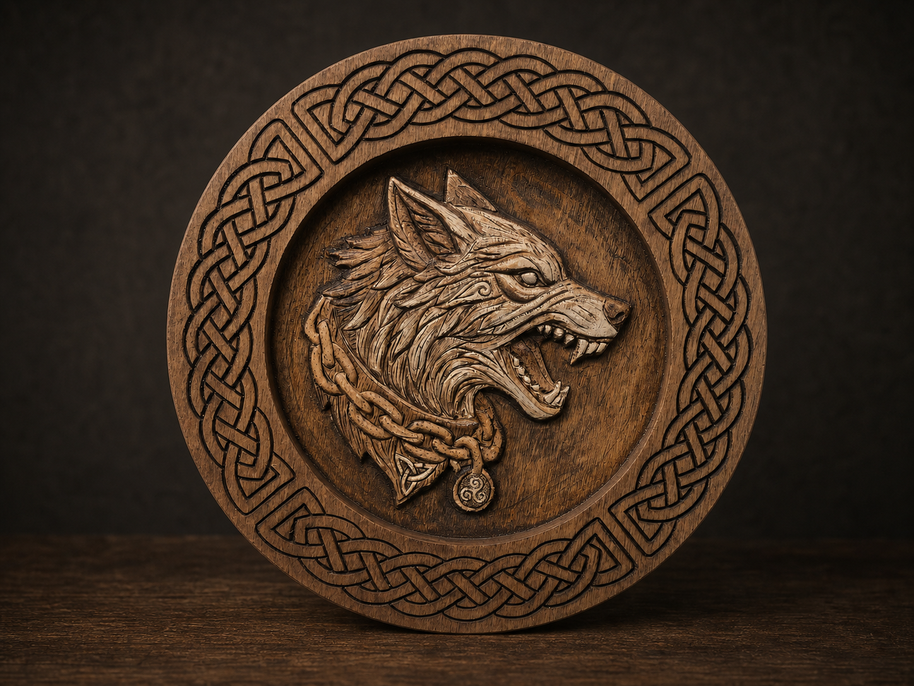
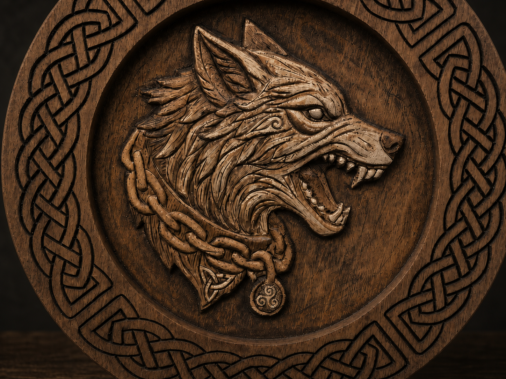

The Wolf Guardian is a compact circular relief built around presence, strength, and the defence of a boundary. The wolf is shown alert and unrestrained, its open jaw and focused eye giving the piece a sense of immediate movement.

This is a personal symbolic composition rather than a reproduction of a historical artefact. Celtic-inspired interlace frames the central figure, while the wolf carries a heavy chain and two small pendants: a triangular knot and a circular triskele.

## The guardian at the threshold

The expression is deliberately intense. This is not a distant or passive animal portrait, but a guardian confronting what approaches. Layered strands of fur lead into the chain, tying the living form to the symbolic details beneath it.

The continuous outer knot creates a second boundary around the animal. Its crossings have no obvious beginning or end, giving the frame a feeling of continuity and enclosure. Within it, the triskele introduces movement, while the triangular knot provides a smaller point of balance against the force of the wolf's head.

## Material and scale

The relief belongs to the same small-format body of work as The Raven Sigil and has been produced in ash and birch. The pieces are approximately **22 cm in diameter** and **22 mm thick**.

That scale keeps the work intimate while still allowing enough depth for the recessed field, overlapping fur, open jaw, chain, pendants, and outer interlace to remain distinctly tactile.

## Building depth

The process begins with CNC machining, which establishes the round foundation and removes the principal volumes. The machine provides an accurate starting structure, but it does not define the finished character of the piece.

Small Mikisyo chisels are used to refine the transition between layers, sharpen the silhouette, open the spaces around the teeth and chain, and bring individual strands of fur forward. This handwork breaks the uniformity of the machined surface and gives the relief its final rhythm.

Pyrography with a Razertip tool strengthens selected contours and recesses. Dark lines separate the knot crossings, clarify details in the face and pendants, and increase contrast without hiding the natural grain. An Osmo finish protects the surface and deepens the colour of the timber.

## Precision and instinct

The Wolf Guardian brings together two different kinds of control. CNC machining provides measured depth and repeatable structure; hand carving and fire introduce decisions that respond directly to the wood. The final surface carries both systems at once.

Like the raven, the wolf is part of an evolving collection and is not yet available through Etsy. Final product photography and availability details will be added when the series is ready for release.
